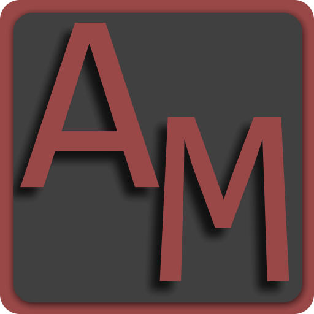
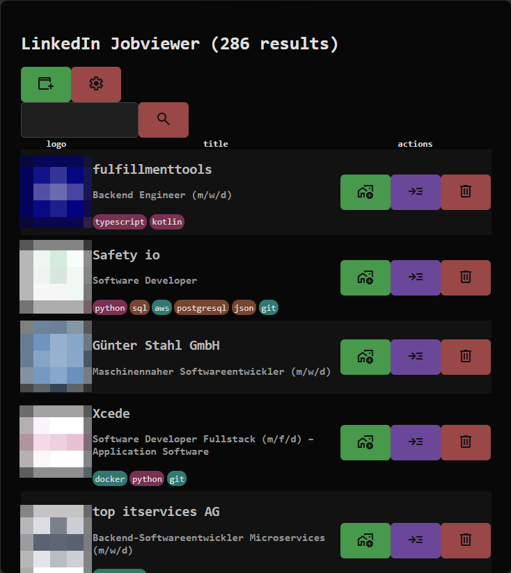
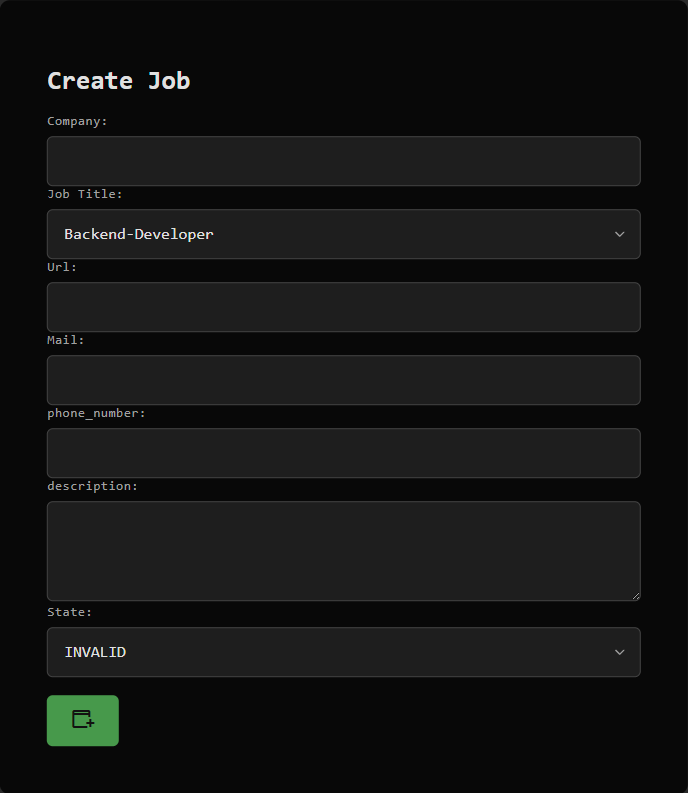
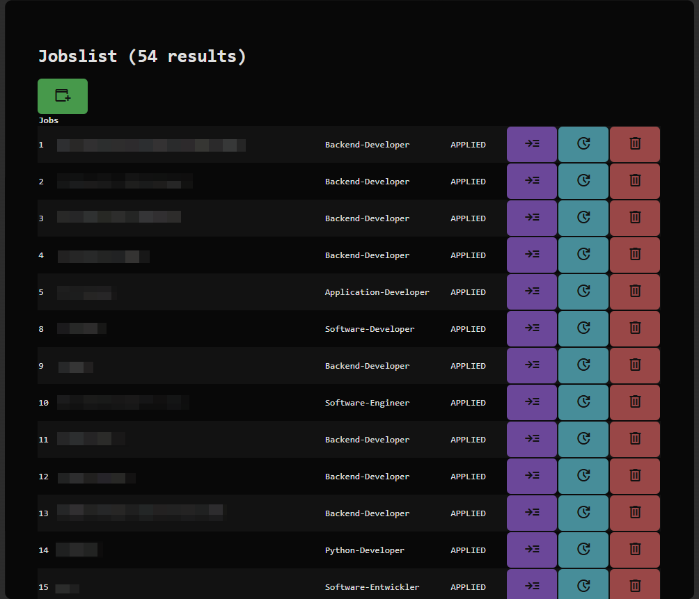
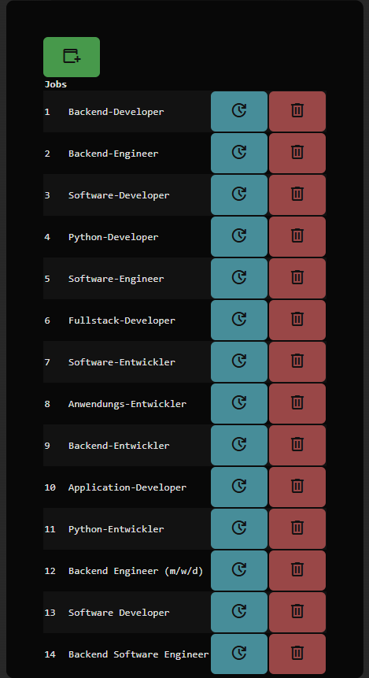
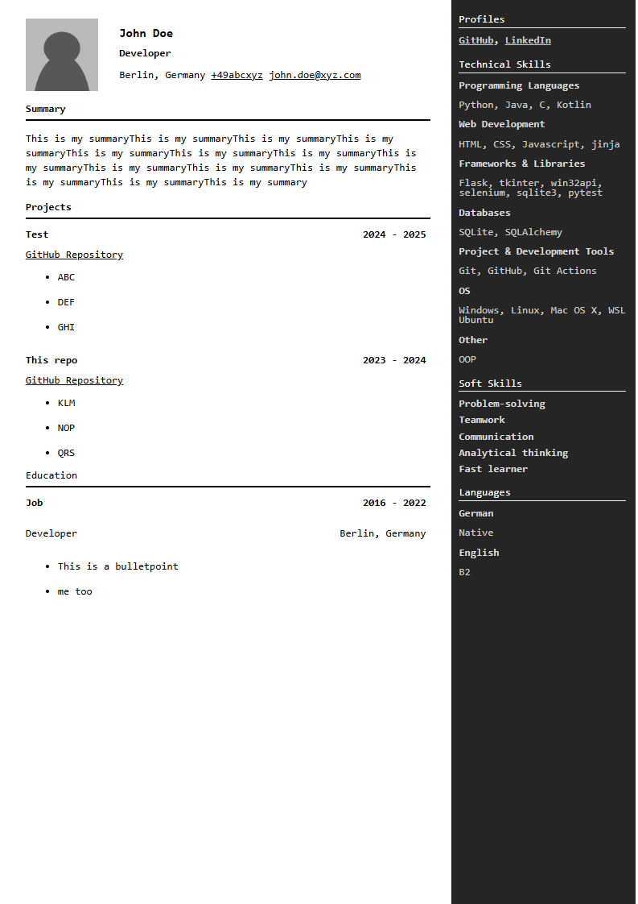

# Application-Manager(WIP)



This is an easy to use Manager for your job-applications.

Did you ever struggle with the massive ammount of data, errors, the linkedIn search or creating a CV?

Then is this your go to app for job-applications.

Manage your job-applications, job-titles/professions, linkedIn jobs, create & manage CVs and more.

# How to get started?

Before you get started you need to install some packages:
```bash
pip install -r requirements.txt
```

Now you can start the flask-application:
```bash
python main.py
```

Go to your browser and enter `127.0.0.1:5000`

## Functionality

### Import Jobs from LinkedIn



You can easily import Jobs from LinkedIn by parsing the `LinkedIn/jobs` site `html` to the app.

1. Load the `https://www.linkedin.com/jobs/search/` site and search for your desired profession / job_title
2. Open the dev-console with `F12`
3. Goto Tab: `Elements`
3. Scroll to the bottom in the job-listings
4. in the dev-console
    1. right-click on the html-tag
    2. click `edit as HTML`
    3. Copy the entire HTML from here
    4. insert the HTML into the textinput in `/linkedin/create`
    5. Press on Add

> [!NOTE]
> If you want to import: site 1...2...3... you need to :
> * reload the linkedin site each time.
> * Do the step 3 & 4 again

### Creating Jobs





You can save your job-applications for later use or statistics in `jobs/create`.

The following values are accepted here:
* **Company**(*): The company name.
* **Job title**(*): You can select from already existing `job-titles`. If you can see nothing in the dropdown, you did forget to create a `job-title`.
* **URL**(*): The companys website.
* **Mail**
* **phone_number**
* **description**

### Creating a job-id



A job/profession-id is needed for creating a job.

The following values are accepted here:
* **name**

### CV Creation



The CVC data is in stored in a python class.

You need to import this in `cv/create`, here you must set a name for your `CVC`.

The data will be stored in the CVC Database and loaded in runtime!

Now select your CV in `cv/` and go to the read page of this element.

Here you need to hit `strg + p` and select the `save as pdf` option.

> [!NOTE] The contents on the left side must be greater than the left-side itself!
> Otherwise the CV break, this is a bug, that if will fix later.

An CVC Example:
```python
from src.backend.cv_creator.objects import *

class CVC:
    NAME = "John Doe"
    PROFESSION = "Developer"
    CITY = "Berlin"
    COUNTRY = "Germany"
    PHONE_NUMBER = "+49abcxyz"
    MAIL = "john.doe@xyz.com"
    SUMMARY_CONTENT = "This is my summaryThis is my summaryThis is my summaryThis is my summaryThis is my summaryThis is my summaryThis is my summaryThis is my summaryThis is my summaryThis is my summaryThis is my summaryThis is my summaryThis is my summaryThis is my summary"
    SIDEBAR_ELEMENTS = [
        Head('Profiles'),
            Links(['xyz.de','xyz.en'], ['GitHub', 'LinkedIn']),
        Head('Technical Skills'),
            Title('Programming Languages'),
                Content('Python, Java, C, Kotlin'),
            Title('Web Development'),
                Content('HTML, CSS, Javascript, jinja'),
            Title('Frameworks & Libraries'),
                Content('Flask, tkinter, win32api, selenium, sqlite3, pytest'),
            Title('Databases'),
                Content('SQLite, SQLAlchemy'),
            Title('Project & Development Tools'),
                Content('Git, GitHub, Git Actions'),
            Title('OS'),
                Content('Windows, Linux, Mac OS X, WSL Ubuntu'),
            Title('Other'),
                Content('OOP'),
        Head('Soft Skills'),
            Title('Problem-solving'),
            Title('Teamwork'),
            Title('Communication'),
            Title('Analytical thinking'),
            Title('Fast learner'),
        Head('Languages'),
            Title('German'),
                Content('Native'),
            Title('English'),
                Content('B2'),
    ]
    PROJECTS = [
        Project('Test', '2024 - 2025', '#nope', 'GitHub Repository', 
                [
                    Bulletpoint('ABC'),
                    Bulletpoint('DEF'),
                    Bulletpoint('GHI')
                ]),
        Project('This repo', '2023 - 2024', '#nope', 'GitHub Repository', 
                [
                    Bulletpoint('KLM'),
                    Bulletpoint('NOP'),
                    Bulletpoint('QRS')
                ])
    ]
    EDUCATION = [
        EducationOrExperience('School', '2006 - 2015', 'Student', 'Berlin, Germany',
                              [
                                  Bulletpoint('This is a bulletpointThis is a bulletpointThis is a bulletpointThis is a bulletpointThis is a bulletpointThis is a bulletpointThis is a bulletpointThis is a bulletpointThis is a bulletpointThis is a bulletpointThis is a bulletpointThis is a bulletpointThis is a bulletpointThis is a bulletpointThis is a bulletpointThis is a bulletpointThis is a bulletpointThis is a bulletpointThis is a bulletpointThis is a bulletpointThis is a bulletpointThis is a bulletpoint'),
                                  Bulletpoint('me too')
                              ])
    ]
    EXPERIENCE = [
        EducationOrExperience('Job', '2016 - 2022', 'Developer', 'Berlin, Germany',
                              [
                                  Bulletpoint('This is a bulletpoint'),
                                  Bulletpoint('me too')
                              ])
    ]
```


### Export
You can easily export your job-applications as `json` or `csv`

## Others:
* Easy job application report export in json format
* Easy job application report export in csv format
* Auto-extract the phone-number, e-mail & address from the linkedin job page.

## 🗺Development-Status
Work in progress:

* MVP completed✅
* All functionalitys planned for the MVP-State are implemented right now.✅
* The documentation for developers is unfinished.❌
* The documentation for users is "finished".⚠(Some things might be unclear! Please file an issue in this case.)

In the future i will add:
* [ ] Coverletter Creator
* [ ] The AI improve_writing function(delayed & moved to `after_mvp`)

[^1] Copyright 2025 Justus Decker - Project Application-Manager licensed under GPL V3